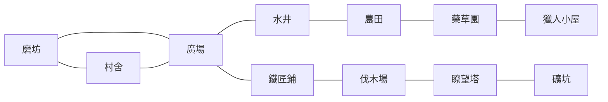

# 《人狼村》正式規則書

> 版本：核心規則 v1.0  
> 適用人數：6–15 個角色槽位，可由真人與公開標示的 AI 玩家共同組成。  
> 本文件是玩家、房主、企劃、美術文案與後續 agent 應優先採用的正式規則。

---

## 1. 遊戲概念

很久以前，村落中央的烽火曾經徹夜不熄。人們相信，只要高塔上的火焰仍在，潛藏於黑夜中的野獸便無法顯露真身。然而在一個沒有月亮的夜晚，烽火熄滅了，沉睡已久的詛咒也再次降臨。

從那天起，部分村民會在夜裡化身為狼。詛咒也遮蔽了所有人的面貌與聲音，使前往同一地點工作的人能夠交談，卻無法認出彼此。當黎明到來，眾人只能帶著前一夜留下的產物、懷疑與死亡消息，重新回到廣場。

村民不能只靠投票活下去。糧食會逐日減少，建設需要材料，救人與下毒則仰賴珍貴的藥草。好人必須在飢荒吞噬村落以前找出所有狼人，或收集足夠的材料，讓熄滅已久的烽火重新燃起。

### 玩法摘要

- 白天的推理、發言、提案與投票。
- 夜晚的匿名相遇與短時間語音。
- 食物、材料與藥草形成的生存壓力。
- 狼人在工作、偷懶、破壞與殺人之間的選擇。
- 玩家是否願意向昨夜那個看不清面孔的人交付信任。

---

## 2. 陣營與用語

### 2.1 陣營

- **狼人陣營**：狼人、暗夜術士，以及未來明確標示為狼人陣營的角色。
- **神職**：預言家、女巫、獵人、白癡、九尾狐、禁票長老、騎士、潛行者、花蝴蝶與守衛。
- **平民陣營**：平民與暗戀者。
- **好人方**：神職與平民陣營的合稱。

暗戀者在一般規則、查驗及屠邊計算中屬於平民陣營，但最終個人勝負跟隨暗戀對象。

### 2.2 常用名詞

- **同地點**：夜晚位於同一個地圖節點。每名玩家的私人村舍是互相隔離的空間，不視為真正共處。
- **相鄰地點**：兩個地點在地圖上由一條路線直接相連。
- **有效工作者**：在 15 秒行動時間內，累計按住工作鍵至少 10 秒的玩家。
- **產量上限**：地點能計入產出的有效工作者人數上限，不限制玩家前往該地。
- **瀕死**：已受到致死效果，但夜間批次尚未完成，仍可能被救援或因規則繼續行動。
- **刀人**：狼人陣營的基礎夜間擊殺。
- **放逐**：白天的一般公投淘汰。
- **飢荒處決**：食物不足時的匿名強制投票，與一般放逐不同。
- **翻牌**：角色依技能主動公開自己的真實職業。
- **共享資源**：全村共同持有的食物、材料與藥草。

---

## 3. 開局設定

### 3.1 房主設定

房主可以設定：

- 使用內建板子或自訂職業配置。
- 狼人勝利模式：屠邊或屠城。
- 輪流發言或自由發言，以及發言時間。
- 初始食物數量；不得低於本局總角色數。
- 女巫能否自救。
- 資源資訊的公開程度。
- 夜間匿名外觀及變聲器是否每晚重抽。
- 是否使用 AI 補足空缺角色槽位。

初始材料固定為 0。每有一名女巫，初始共享藥草增加 1 份。沒有女巫時仍可累積藥草，但目前沒有其他角色能使用。

除板子另有說明外，同一特殊職業預設只設一個名額。自訂配置的角色槽位不得少於真人玩家數；不足的槽位可以由 AI 補足。地圖開放、建設費用及初始食物下限，全部依真人與 AI 的角色總數判定。

實際使用的職業配置會向全房公開，但每張職業牌落在誰身上仍然保密。狼人彼此知道隊友的玩家身分與精確狼人職業，除非未來角色明確規定對隊友隱藏。

### 3.2 內建 12 人板子

| 板名 | 狼人陣營 | 神職 | 平民陣營 |
|---|---|---|---|
| 444 預女獵白 | 狼人×4 | 預言家、女巫、獵人、白癡 | 平民×4 |
| 444 預女獵九 | 狼人×4 | 預言家、女巫、獵人、九尾狐 | 平民×4 |
| 4431 預女獵白戀 | 狼人×4 | 預言家、女巫、獵人、白癡 | 平民×3、暗戀者 |
| 444 禁騎 | 狼人×4 | 預言家、女巫、騎士、禁票長老 | 平民×4 |
| 444 禁潛 | 狼人×4 | 預言家、女巫、潛行者、禁票長老 | 平民×4 |
| 444 暗禁 | 狼人×3、暗夜術士 | 預言家、女巫、潛行者、禁票長老 | 平民×4 |
| 444 花蝴蝶 | 狼人×4 | 預言家、花蝴蝶、潛行者、獵人 | 平民×4 |

其他人數使用房主自訂配置。屠邊房必須至少有一名神職及一名平民陣營角色；暗戀者存在時，必須另有至少一名可選為暗戀對象的玩家。

### 3.3 AI 玩家

AI 玩家占用正常角色槽位，其 AI 身分會向全房公開。房間人數不足時可以由 AI 補位；真人斷線後也可由 AI 暫時代管。AI 的完整行為、資訊權限與重連交接將另立規格，不在本規則書中展開。

---

## 4. 勝利條件

### 4.1 狼人陣營

開局時由房主選擇其中一種：

- **屠邊**：所有神職死亡，或所有平民陣營角色死亡，狼人勝利。
- **屠城**：所有神職與所有平民陣營角色全部死亡，狼人勝利。

暗夜術士等強化狼人會被計入狼人陣營。

暗戀者通常仍計入平民陣營；但若場上除了狼人陣營以外，只剩暗戀對象屬狼人陣營的暗戀者，狼人直接達成勝利，無須殺死暗戀者。暗戀對象即使已死亡，只要其所屬狼人陣營最終獲勝，暗戀者也跟隨獲勝。

### 4.2 好人方

好人方透過以下任一方式獲勝：

- 所有狼人陣營玩家均已死亡。
- 成功完成廣場的最終建設「烽火台」。

### 4.3 夜間勝負優先序

若烽火台在當晚成功完成，神蹟會取消當晚所有尚待結算的非狼人死亡，並立即宣告好人勝利。白天已發生的死亡不會被回溯取消；狼人自殺也不會被神蹟阻止。

若烽火台沒有完成，先結算狼刀批次的保護、救援、暗戀與死亡。狼人若已在這個批次完成屠邊或屠城，立即獲勝，尚未進入的神職能力不再發動。

狼人尚未獲勝，才繼續結算女巫毒藥、潛行者暗殺、暗夜術士挽救等後續能力。每個完整批次結束後，固定先檢查狼人勝利，再檢查狼人是否全滅。

死亡玩家仍可因其原陣營最後獲勝而取得勝利；暗戀者不論生死，最終勝負皆跟隨暗戀對象。

---

## 5. 第一天：準備日

遊戲從白天開始，但第一天是準備日：

- 不消耗食物，也不進行飢荒。
- 不進行警長競選與一般放逐。
- 騎士不能決鬥，狼人不能自爆。
- 玩家可以認識號碼、閱讀公開板子、討論工作分配。
- 會議期間可開始選擇第一夜目的地，直到入夜前都能更改。

第一夜的夜間能力正常開放。狼人可以刀人，女巫可以用毒，預言家可以查驗；潛行者因尚未參加過放逐投票，沒有合法暗殺目標。

第一個白天結束後，暗戀者秘密選擇一名其他玩家作為暗戀對象。

---

## 6. 一般白天流程

從第二天起，每個白天依序進行：

1. **黎明死亡公布**：公布昨夜死亡者姓名，不公開職業與死因。
2. **黎明能力與遺言**：處理第一夜死者遺言、獵人等死亡能力。
3. **公開情報**：公布設施、地點及資源設定允許顯示的情報。
4. **食物消耗與飢荒**：每名存活玩家消耗 1 份食物；不足時進行飢荒處決。
5. **警徽移交**：昨夜死亡的警長在飢荒結束後，選擇一名存活玩家繼承警徽，或撕毀警徽。
6. **第二天警長競選**：整局只舉行一次；之後不會重新競選。
7. **白天會議**：依房主設定輪流發言或自由討論；玩家可同時暫選夜間目的地。
8. **建設提案與白天能力**：表決廣場工程；騎士可決鬥，狼人可自爆。
9. **一般放逐投票**。
10. **白天死亡、遺言與立即警徽移交**。
11. **目的地最終確認**：玩家可作最後一次更改，然後進入黑夜。

若某階段已觸發勝利，完成該批白天死者的遺言後顯示最終結果；遺言期間不能再發動能力、提案或投票。

### 6.1 遺言

- 第一夜死亡的所有玩家都有遺言；第二夜起的夜死者沒有遺言。
- 所有白天死亡者都有遺言，包含飢荒、放逐、決鬥、獵人帶走、狼人自爆及暗戀連鎖。
- 每段遺言為 15 秒，死者可提前結束。
- 同一批多人死亡時，依玩家編號由小到大發表。
- 遺言不會公開職業；獵人、白癡等角色仍可依技能主動翻牌。

### 6.2 狼人自爆

狼人可在正式會議開始後、一般放逐投票鎖定前自爆。最先成功自爆者立即死亡並公開「狼人陣營」，其他同時自爆取消。

自爆會中止會議與尚未發動的白天能力。自爆狼人發表 15 秒遺言後，跳過一般放逐，但所有玩家仍有一次目的地最終確認，接著進入夜晚。

---

## 7. 警長系統

### 7.1 警長競選

- 只在第二天、食物與飢荒結束後舉行一次。
- 存活且未缺席的玩家可選擇參選；系統不允許所有人參選，必須至少保留一名投票者。
- 候選人按玩家號碼由小到大發言，發言後可以退選。
- 候選人不能投警長票；退選後恢復警長投票權。
- 獵人小屋缺席者不能參選或發言，但可透過返程送回的密封選票參與警長投票。
- 被禁票者與已翻牌白癡仍可投警長票。
- 每張警長選票固定為 1 票；候選人只有一名時自動當選。
- 無人參選則本局沒有警長。
- 票數平手時，平票者重新發言並進行只限平票者的 PK 重投。
- 逾時未投者由系統隨機投給一名合法候選人。

### 7.2 警長權力

- 警長在一般放逐、飢荒與建設提案中擁有 1.5 票。
- 警長每天選擇由自己號碼向前或向後排列發言順序；死亡與缺席玩家跳過，警長永遠最後發言。
- 若當天沒有警長且昨夜有人死亡，系統隨機選一名昨夜死者，再隨機由其前一號或後一號方向找到第一名可發言玩家。
- 若沒有警長且昨夜也無人死亡，系統隨機選擇一名可發言玩家與方向。
- 警長本人缺席時，當天由系統隨機決定起點與方向。

### 7.3 警徽移交

- 警長死亡時可以把警徽交給任意一名存活玩家，也可以撕毀警徽。
- 夜間死亡的警長，在下一個白天完成食物與飢荒後選擇。
- 白天死亡的警長，在死亡與遺言結束後立即選擇。
- 警徽一旦撕毀，本局不再選出新警長。
- 死亡警長只能使用自己依法取得的角色資訊與公開資訊，不能使用死者觀戰資訊作選擇。

---

## 8. 投票與飢荒

### 8.1 一般放逐

- 投票進行時匿名，結算後公開每人的投票去向。
- 可以投自己或棄票；逾時視為棄票。
- 最高票者遭到放逐。
- 最高票平手時，平票者各有一次補充發言，再進行只限平票者的重投。
- 重投時平票候選人可以投票，也可以投自己。
- 再次平票則當天無人放逐。
- 沒有投票權或缺席的玩家仍可成為放逐目標。

白癡翻牌免除放逐後，當天不改放第二高票，也不重新投票。

### 8.2 食物與飢荒

每天從第二個白天起，先比較存活人數與食物庫存。食物不足時，逐次進行匿名飢荒投票，直到存活人數不高於能供應的食物份數；隨後再由每名存活玩家各消耗 1 份食物。

- 飢荒投票永久匿名，只公布犧牲者與加權票數。
- 不能棄票；逾時由系統隨機投給一名合法目標。
- 最高票平手時立即重投；再次平手則由系統在平票者中隨機處決一人。
- 警長擁有 1.5 票。
- 禁票長老的效果不影響飢荒投票。
- 獵人小屋缺席者不能投飢荒票，但仍可成為目標。
- 白癡不能免除飢荒處決；獵人也不能因飢荒處決而開槍。
- 每處決一人便完整處理其遺言、死亡能力與勝負，再判斷是否仍需下一輪飢荒。

---

## 9. 夜間目的地與匿名相遇

### 9.1 地點牌與夜行令

- 每晚每名玩家從所有合法開放地點中，隨機取得 3 張不重複的地點牌。
- 玩家可在白天會議期間選擇並更改，直到目的地最終確認。
- 每名玩家每局擁有一張「夜行令」，使用後可在該晚選擇任意合法地點。
- 若在鎖定前改回原本三張牌內的地點，夜行令退還。
- 隨機代選不會消耗夜行令；夜行令的使用不會公開。
- 守衛沒有夜行令，改用專屬巡邏選擇。

### 9.2 匿名外觀與地點語音

- 玩家抵達地點後，只看得到不帶身分資訊的匿名外觀，且看不到自己的匿名外觀。
- 玩家知道同地點總人數，但不知道其他人的姓名、職業或行動。
- 同地點所有玩家共享一個地點語音頻道；其他地點聽不見。
- 語音經過變聲器。房主可選擇匿名外觀與音色整局固定，或每晚一起重抽。
- 工作、偷懶與破壞的外觀和音效完全一致；工作進度只有本人看得見。
- 被成功刀中的玩家會立刻知道自己瀕死，但仍能在地點頻道說話並操作到該夜允許的能力階段結束。

狼人不會在工作時間同時使用兩種語音。目的地鎖定後，狼人先獲得 30 秒全隊語音與文字討論時間，並能看見狼隊成員的最終目的地；討論結束後才進入 15 秒地點工作時間。

---

## 10. 工作與共享資源

- 玩家在夜間場景有 15 秒行動時間。
- 累計按住工作鍵滿 10 秒即完成工作；中途放開不會清除進度。
- 完成後可停止按鍵，但所有人一起等待該階段結束。
- 一般神職可以同時工作並使用職業能力；守衛依巡邏規則例外。
- 玩家當晚完成工作後即使瀕死，產出仍然保留。
- 超過地點產量上限的有效工作者可以留在該處並使用語音，但不再增加產出。
- 食物、材料與藥草會跨日保存，沒有庫存上限或腐敗。

房主可選擇三種資源公開模式：

1. 只顯示目前庫存。
2. 顯示目前庫存與本次總變動量，為標準模式。
3. 顯示目前庫存、總變動量與每個地點帶來的變動量。

詳細模式可能讓破壞行動較容易被推理出來，這是預期的自訂房效果。

---

## 11. 地圖

### 11.1 開放區域

| 初始角色數 | 開放區域 | 開放地點 |
|---|---|---|
| 6–8 | 核心村落 | 廣場、農田、水井、鐵匠鋪、村舍、藥草園 |
| 9–11 | 核心村落＋外環農郊 | 以上地點，再加磨坊、伐木場 |
| 12–15 | 全地圖 | 以上地點，再加礦坑、獵人小屋、瞭望塔 |

開放狀態以開局時真人與 AI 的角色總數決定，本局中不再改變。未開放地點不會出現在地點牌中，也不保留技能相鄰關係。

### 11.2 地圖連線

地圖連線不限制一般玩家移動，只供女巫、守衛等相鄰能力判斷。

村舍在地圖上視為一個整體節點，與廣場、磨坊相鄰；實際進入後，每名玩家都躲在自己的私人住家，彼此看不見、不能交談或互動。瞭望塔只公布村舍的合計人數。

### 11.3 地點功能與文案

#### 廣場

**功能**

- 不直接生產資源。
- 白天通過建設提案後，當晚至少一名廣場玩家完成 10 秒建設工作，即可完成該工程。

**場景文案**

> 石板鋪成的廣場位在村落中央。白日裡，爭辯與指控在此迴盪；夜幕落下後，留下的人則把一根根木樑與鐵釘組成村落最後的希望。每一座設施都從這裡誕生，每一場處刑也從這裡開始。

#### 農田

**功能**

- 每名有效工作者生產 2 份食物。
- 最多計入 3 人，基礎產量上限為 6。
- 可受到水井增產、水井下毒與農田縱火影響。

**場景文案**

> 麥浪在月色下翻湧，像有什麼東西貼著田埂穿行。這片土地養活了整座村莊，也因此成為狼人最想摧毀的命脈。只要一把火，明日的餐桌就可能只剩灰燼。

#### 水井

**功能**

- 至少有一名有效工作者時，使當晚農田總產量增加 1 份食物。
- 每晚最多增加 1；農田沒有有效產出時，水井不會憑空產生食物。

**場景文案**

> 井水沿著古老的溝渠流向農田。乾淨的水能讓作物生長，混入毒物的水卻會悄無聲息地把整季收成拖進泥裡。井面映得出月亮，卻映不出俯身之人的真心。

#### 鐵匠鋪

**功能**

- 每名有效工作者生產 2 份材料。
- 最多計入 1 人，產量上限為 2。

**場景文案**

> 熄滅的爐火不會庇護任何人。只有重新拉動風箱，讓鐵鎚在深夜裡一次次落下，廢鐵才會變成鉚釘、工具，以及抵抗詛咒所需的一切。

#### 村舍（自己家）

**功能**

- 不生產資源。
- 每名玩家各自位於獨立空間，不能與其他村舍玩家互動或語音。
- 狼人不能在村舍刀人或自殺。
- 女巫不能在村舍毒人，潛行者也不能暗殺躲在村舍的目標。
- 村舍不能被守衛選為巡邏地點，也不能建造柵欄；它本身已是安全區域。

**場景文案**

> 門閂、爐火與熟悉的床鋪，讓這裡成為長夜中少數能喘息的地方。躲在家裡不會替村落帶回糧食，也蓋不起任何設施；但至少今夜，屋外的爪痕只能停在門前。

#### 藥草園

**功能**

- 至少有一名有效工作者時生產 1 份藥草。
- 最多計入 1 人，產量上限為 1。
- 狼人可使藥草園在接下來兩晚停止產出。

**場景文案**

> 石牆圈起一小片帶著苦香的土地。能救命的葉與能奪命的根在這裡並肩生長，差別只在採摘它的人，最後把藥草交到誰的手上。

#### 磨坊

**開放條件**：9 個角色起。

**功能**

- 每名有效工作者生產 3 份食物。
- 最多計入 2 人，產量上限為 6。

**場景文案**

> 巨大的磨輪在夜風裡緩慢轉動，把白日收下的穀粒碾成能入口的糧食。齒輪聲蓋過了腳步，也讓藏在陰影裡的人更難被察覺。

#### 伐木場

**開放條件**：9 個角色起。

**功能**

- 每名有效工作者生產 1 份材料。
- 最多計入 3 人，產量上限為 3。

**場景文案**

> 林線邊緣堆滿尚未劈整的原木。這裡人多時效率穩定，人少時卻只剩斧刃劃破夜色的聲音——一下，又一下，直到你分不清那究竟是在砍樹，還是在向誰靠近。

#### 礦坑

**開放條件**：12 個角色起。

**功能**

- 每名有效工作者生產 3 份材料。
- 最多計入 1 人，產量上限為 3。

**場景文案**

> 狹窄坑道深入山腹，火把只能照亮身前幾步。礦脈帶來最快的材料，也把工作者送到最遠、最封閉的黑暗之中。若有人在這裡失蹤，呼救聲未必能傳到洞口。

#### 獵人小屋

**開放條件**：12 個角色起。

**功能**

- 每名有效工作者生產 8 份食物。
- 最多計入 1 人，產量上限為 8。
- 所有前往此處的玩家，不論是否計入產量，隔天都因來不及回村而缺席。
- 缺席者可以聽見會議，但不能發言、不能參選、不能使用需要本人在場的白天能力，也不能參加一般放逐或飢荒投票。
- 缺席者仍消耗食物、可成為白天能力與投票目標，並能透過特殊選票參與警長選舉及建設表決。
- 缺席者仍可在白天結束前選擇下一晚目的地。

**場景文案**

> 小屋藏在森林深處，牆上掛滿獸骨與陳舊陷阱。願意走到這裡的人，往往能帶回足以餵飽眾人的獵物；代價是天亮時仍在返程，只能隔著遙遠的鐘聲，聽村民決定誰該活下來。

#### 瞭望塔

**開放條件**：12 個角色起。

**功能**

- 不生產資源，最多計入 1 名有效工作者。
- 完成工作後，隔天公開前一晚所有開放地點的到場人數，包含 0 人地點、瞭望塔自身及當晚後來死亡者。
- 村舍只顯示所有私人住家的合計人數。
- 只公布人數，不公布姓名、職業或行動。

**場景文案**

> 高塔越過樹梢，能看見夜裡各處搖曳的燈火。守望者辨不清火光旁站著誰，卻能數出有多少影子走進農田、多少人躲回家中，以及哪個地方安靜得不合常理。

---

## 12. 廣場建設

### 12.1 建設費用

| 建設 | 6–8 個角色 | 9–11 個角色 | 12–15 個角色 |
|---|---:|---:|---:|
| 大燈 | 4 材料 | 8 材料 | 12 材料 |
| 柵欄 | 4 材料 | 8 材料 | 12 材料 |
| 烽火台 | 8 材料 | 15 材料 | 25 材料 |

每種建設每局只能完成一次；因此整局最多只有一座柵欄。

### 12.2 建設提案

- 白天材料已足夠時，任何存活玩家都能提出一項或多項建設提案。
- 每名存活玩家只能將建設票投給其中一案或棄權；缺席、被禁票及失去放逐投票權的白癡仍有建設表決權。
- 一般玩家 1 票，警長 1.5 票。
- 取得超過存活玩家人數一半票值的唯一提案通過。例如 10 人局必須超過 5 票；4 名一般玩家加警長共 5.5 票即可通過。
- 每天最多通過一案。若沒有提案過半，當天沒有工程。
- 柵欄的保護地點在白天表決時一併決定。
- 提案不能預支當晚將取得的材料。
- 提案通過後，當晚只要至少一名廣場玩家完成 10 秒建設工作，工程立即完成並扣除材料。
- 無人完成建設時不扣材料，提案隔天失效，必須重新表決。

### 12.3 大燈

**效果**

- 建成後永久生效。
- 每天白天自動公布前一晚磨坊、水井與鐵匠鋪的到場人數。
- 未開放地點顯示「未開放」，而不是 0 人。
- 若瞭望塔也生效，情報合併成同一份地點人數報告。

**完成文案**

> 工匠點燃高懸的大燈，暖黃光線沿著村道鋪展，照亮磨坊轉動的長影、水井邊來去的腳步，以及鐵匠鋪徹夜未熄的爐火。黑夜仍舊存在，但從今以後，它再也無法把所有秘密藏得滴水不漏。

### 12.4 柵欄

**效果**

- 永久保護表決時指定的一個開放地點；不能指定村舍。
- 阻止發生在該地點的狼人刀人、自殺、女巫毒殺與其他未明確寫出穿透效果的夜間直接殺害。
- 潛行者暗殺可以穿透柵欄。
- 柵欄不能被狼人破壞。

**完成文案**

> 削尖的木樁沿著道路一根根立起，鐵絲與鈴索封住每一道缺口。它未必能讓人安心，卻足以讓任何心懷殺意的訪客在靠近以前，先驚動整座村莊。

### 12.5 烽火台

**效果**

- 建成後觸發神蹟，取消當晚所有尚待結算的非狼人死亡。
- 白天已發生的死亡不會復原，狼人自殺也不會被阻止。
- 好人方立即獲勝。

**完成文案**

> 最後一束火焰攀上高台，光芒越過屋瓦、田野與沉睡的森林，將盤踞此地多年的詛咒一寸寸逼回黑暗。狼人再也無法披上獸形，只能以凡人的姿態留在村中。此後百年，夜裡仍有風聲，卻再也沒有人聽見狼嚎。

---

## 13. 狼人共通行動

除角色另有說明外，所有狼人陣營角色都能使用狼人共通行動。偽裝工作、偷懶、破壞與刀人是互斥的地點行動；選擇其中一項後，不能再正常完成另一項。

### 13.1 偽裝工作

狼人完成和好人相同的工作操作，正常計入地點產量。

> 他把利爪藏進掌心，與眾人一同拉動繩索。今夜的糧食沒有短少，於是沒有人注意到，他工作得像個好人，只是為了讓明天的謊言更像真的。

### 13.2 偷懶

狼人抵達地點，但不產生工作成果。系統會播放與正常工作完全一致的假動作；其他玩家只能知道有人在場，不能從動畫直接判斷是否工作。

> 他讓工具發出足夠多的聲響，卻沒有真正完成任何事。直到天亮，人們才會發現少掉的不是一袋穀物，而是一整晚能被相信的時間。

### 13.3 刀人

一個地點同時符合以下條件時，該處的狼人可以刀人：

- 至少有 1 名狼人陣營玩家。
- 恰好只有 1 名非狼人玩家。
- 地點沒有受到村舍、柵欄、守衛或花蝴蝶等效果保護。

只要其中一名狼人按下刀人，唯一的非狼人立即進入瀕死狀態。執行刀人的狼人不能工作；其他同地點狼人仍可自行選擇工作、偷懶或其他合法行動。

同一地點每晚最多由狼人殺 1 人，但不同地點可以在同一晚分別出刀，因此全隊一晚可能造成多名受害者。多名狼人幾乎同時按刀時，只接受第一名成功出刀者，其他人的按鈕立即關閉。

受害者會知道自己已被刀中，仍能在地點語音發言，並在狼人尚未先取得勝利的前提下，完成當晚依法可用的工作或職業能力。

若刀人條件不足或地點受到保護，刀人按鈕顯示為不可使用。守衛的秘密巡邏也可能因此被狼人察覺，屬於既定資訊效果。

> 當最後一個無辜者發現自己被包圍，工作聲便停了下來。接下來的十幾秒裡，他仍能開口，也仍能求救；只是同一個地點以外，沒有人聽得見。

### 13.4 自殺

- 狼人可以在夜間選擇殺死自己，不需要同地點存在非狼人。
- 自殺者不能工作。
- 村舍、柵欄、守衛與花蝴蝶可以阻止狼人自殺。
- 烽火台的神蹟不會阻止狼人自殺，但好人仍會因烽火台完成而勝利。

### 13.5 地圖破壞

破壞必須由狼人陣營玩家在該地點獨處時發動，也就是整個地點只有發動者一人。暗夜術士等強化狼人同樣可以破壞。花蝴蝶能封鎖被擁抱者的破壞；柵欄與守衛不能阻止破壞。

#### 水井下毒

- 發動者必須獨處於水井。
- 發動者不會提供水井的正常增產。
- 當晚農田產量減少 1，最低為 0。
- 若農田同晚沒有產出，下毒可能完全無效；這仍會消耗狼人的行動。

> 一小包粉末落入井中，沒有氣味，也沒有顏色。水面只泛起幾圈漣漪，便重新映出完整的月亮。直到收成時，人們才會知道，有些毒不是為了殺人，而是為了讓所有人一起挨餓。

#### 農田縱火

- 發動者必須獨處於農田，因此當晚農田沒有人正常工作。
- 使入夜前的村落食物庫存減半，奇數無條件捨去。
- 當晚磨坊、獵人小屋等其他地點後來取得的食物不受減半影響。
- 每晚只能縱火一次。

> 火舌沿著乾燥的麥稈竄開，頃刻間便把整片田野染成赤紅。鐘聲響起時，縱火者早已混回人群，只留下焦黑的土地，和每個人都不願面對的明日。

#### 破壞藥草園

- 發動者必須獨處於藥草園。
- 當晚無法工作；從下一個夜晚起，藥草園連續兩晚無法產出藥草。
- 兩晚過去後，新的藥草才會重新長出，不需要玩家額外修復。
- 停產期間再次遭破壞，剩餘時間重置為接下來兩晚，不會累加。
- 系統只顯示沒有取得藥草，不公開破壞原因與破壞者。

> 他沒有折斷枝葉，而是把腐敗的根汁埋進土裡。藥草仍然青翠，氣味也與平常無異。第一個夜晚，人們只以為收成不好；第二個夜晚，土壤依舊沉默。直到腐敗退去，新的嫩芽才終於敢從黑土中探出頭來。

---

## 14. 職業規則

本節記錄完整職業規則。遊戲內角色頁面使用的傳說文案、簡明能力介紹與互動問答，另見 [CHARACTER_GUIDE_ZH_TW.md](./CHARACTER_GUIDE_ZH_TW.md)。

### 14.1 好人方

#### 平民

**功能**

- 沒有主動職業技能。
- 透過工作、發言、提案與投票協助好人獲勝。

**角色文案**

> 你沒有預言、毒藥，也沒有能斬斷詛咒的劍。你有的只是一雙能工作的手、一張能說服別人的嘴，以及在所有人開始互相懷疑時，仍願意相信真相存在的勇氣。

#### 預言家

**功能**

- 每晚工作階段結束後，可查驗任意一名其他存活玩家，不受地點與缺席影響。
- 狼人陣營顯示為「壞人」，所有非狼人顯示為「好人」。暗戀者顯示好人。
- 不能查驗自己。
- 預言家即使在狼刀批次瀕死，只要狼人尚未因此獲勝，仍可完成當晚查驗。
- 夜死預言家仍能看到結果；若沒有警徽或遺言，便無法把資訊傳給存活者。

**角色文案**

> 你看不見一個人的姓名與過去，只看得見靈魂在月光下投出的顏色。無論對方躲在村舍、礦坑或遙遠的獵人小屋，命運都會在入睡以前，替你揭開那顆心究竟屬於人，還是屬於狼。

#### 女巫

**功能**

- 所有女巫共用藥草庫存；每名女巫為開局帶來 1 份初始藥草。
- 女巫能觀察自己所在地與所有相鄰地點的瀕死者，看到姓名及所在地，不看見攻擊者與精確死因。
- 每個可救援攻擊批次中，每名女巫可消耗 1 份藥草，選擇 1 名玩家使用解藥；解藥取消該玩家在該批次受到的全部攻擊。
- 一名女巫同一晚最多可在狼刀批次與神職攻擊批次各使用一次解藥，只要共享藥草仍足夠。
- 女巫可消耗 1 份藥草，毒殺同地點的一名其他玩家；村舍中沒有可毒目標。
- 一名女巫當晚只要使用過任何解藥，就不能再用毒；使用過毒，也不能在任何批次使用解藥。
- 是否允許女巫用解藥救自己，由房主設定；女巫不能毒自己。
- 多名女巫可以在同一晚分別救人或毒人。共享藥草由最先成功確認行動者使用，庫存耗盡後其餘按鈕關閉。
- 女巫即使在狼刀批次瀕死，只要狼人尚未獲勝，仍可進入後續用藥階段。

**角色文案**

> 你熟悉每一種草葉的兩個名字：一個寫在醫書上，用來救人；另一個只在臨死前被低聲說出。藥草從來不分善惡，它只服從最後把它放進杯中的那隻手。

#### 獵人

**功能**

- 被狼人刀殺或遭一般放逐時，可以翻牌並指定任意一名存活玩家一同死亡。
- 翻牌並非強制；逾時視為放棄。
- 女巫毒殺、潛行者暗殺、騎士決鬥、飢荒、九尾狐尾盡及獵人帶走不會觸發。
- 獵人帶走不可被女巫、暗夜術士、村舍、柵欄或守衛阻止，也不會使另一名獵人連鎖開槍。
- 獵人的翻牌與開槍屬於黎明或白天反應，因此不受前一晚花蝴蝶封鎖。

**角色文案**

> 你早已接受自己可能回不了家，所以始終替槍膛留著最後一發。無論利爪從黑暗裡落下，還是繩索在廣場上收緊，你都會在倒下以前，帶走最值得懷疑的那個人。

#### 白癡

**功能**

- 成為一般放逐結果時，可以翻牌並取消自己的死亡。
- 翻牌後永久失去一般放逐投票權，但仍可發言、工作、選地點、投警長票、投飢荒票與參與建設表決。
- 免死每局只能使用一次；當天不改放第二高票，也不重新投票。
- 騎士決鬥、獵人帶走、毒殺、暗殺與飢荒都不能觸發免死。

**角色文案**

> 當所有人都指著你時，你反而笑了。村民終於意識到，自己準備殺死的不是狼人，只是一個從未被任何人認真傾聽的傻子。你保住了性命，卻也從此失去決定他人生死的資格。

#### 九尾狐

**功能**

- 開局擁有 9 條尾巴。
- 每有 1 名平民死亡，失去 1 條尾巴。
- 暗戀者屬平民陣營，死亡時同樣使九尾狐失去 1 條尾巴。
- 每有 1 名神職死亡，失去 2 條尾巴；若特殊房存在多名九尾狐，其他九尾狐死亡也各扣 2 尾。
- 只計最終死亡；被救回者不扣尾。暗戀者代死時按最終死亡的暗戀者扣 1 尾。
- 每晚死亡結算後，仍存活的九尾狐私下得知剩餘尾數。
- 尾巴降至 0 時立即死亡。此死亡不可救援、保護或由暗戀者代替，也不觸發暗戀猜測。

**角色文案**

> 你曾在森林最深處看著村落度過一代又一代，直到狼嚎再次喚醒古老的誓約。九條尾巴承載著守護此地的靈力；每當一名無辜者死去，便有一簇狐火永遠熄滅。當最後的光離你而去，你也將隨村落一同凋零。

#### 禁票長老

**功能**

- 每晚可選擇任意一名存活玩家，包含自己。
- 被選者下一個白天不能參加一般放逐投票。
- 目標會向全村公開，但不公開長老身分。
- 不能連續兩晚指定同一人；可以選擇不使用能力。
- 禁票不影響警長選舉、飢荒與建設表決。
- 長老能同時工作與使用能力；即使在狼刀批次瀕死，只要狼人尚未獲勝，仍能完成禁票。
- 長老當晚最終死亡，已鎖定的禁票仍然生效。

**角色文案**

> 你不需要奪走誰的聲音，只需要在投票前收起他手中的石子。村民可以繼續辯解、哭喊與指控，但至少有一個人的判決，今晨不會落進票箱。

#### 騎士

**功能**

- 每局一次，可在一般放逐投票前向任意一名存活玩家發起決鬥。
- 若目標屬狼人陣營，目標立即死亡，白天結束；處理遺言與警徽後，保留目的地最終確認並直接入夜。
- 若目標不屬狼人陣營，騎士立即死亡，白天流程繼續。
- 暗夜術士視為狼人；暗戀者視為非狼人。
- 決鬥不受夜間地點保護影響。
- 若狼人目標的暗戀者成功代死，狼人目標存活，但白天仍結束並直接入夜。
- 獵人因決鬥死亡不能開槍；白癡也不能免死。

**角色文案**

> 你把劍插在廣場中央，要求懷疑的對象當眾迎戰。聖徽會回應藏在血裡的詛咒：若對方是狼，劍鋒將替村落終結謊言；若你錯了，倒下的人便會是你。

#### 潛行者

**功能**

- 以當天最後一次有效的一般放逐投票為準：若潛行者所投的玩家最終沒有被放逐，當晚可以暗殺該目標。
- 目標因平票存活或白癡翻牌免死，都會使潛行者取得暗殺資格。
- 沒有投票權、棄票、投票目標在入夜前死亡時，不能暗殺。
- 暗殺發生在工作結束後，不妨礙潛行者正常工作。
- 暗殺是全地圖能力，能穿透柵欄與守衛，但不能殺死躲在村舍的目標。
- 暗殺可由女巫解藥或暗夜術士挽救。
- 潛行者即使在狼刀批次瀕死，只要狼人尚未因此獲勝，仍能完成暗殺。

**角色文案**

> 白天，你把票投進箱中，卻看著眾人放走了你認定的怪物。夜裡，你不再需要他們同意。那張沒能完成判決的選票，會在你的袖中摺成一把刀。

#### 花蝴蝶

**功能**

- 每局最多使用 2 次；每次在夜間工作與狼隊討論開始前，選擇任意一名其他存活玩家擁抱。
- 可連續選擇同一人；確認目標就會消耗一次，即使目標後來死亡。
- 被擁抱者知道自己的能力遭到封鎖，但不知道花蝴蝶是誰；全村不會收到通知。
- 被擁抱者當晚的主動與被動職業能力失效，但仍可正常工作。
- 若目標屬狼人陣營，整個狼人陣營當晚不能刀人或自殺。
- 被擁抱狼人仍可工作或偷懶；該目標自己的破壞與暗夜術士挽救失效，其他狼人仍可破壞。
- 花蝴蝶可以同時工作與擁抱。

**角色文案**

> 你的懷抱像一場過分溫柔的夢，讓預言沉默、毒藥失效，也讓舉起的利爪忘記落下。蝴蝶的鱗粉只能迷惑黑夜兩次；第三次靠近誰時，你就只是一個普通人。

#### 守衛

**功能**

- 每晚可選擇 2 個已開放、彼此直接相連且不是村舍的地點作為巡邏區域，並親自前往其中一處。
- 兩地內的所有玩家都受到保護，狼人刀人、自殺、女巫毒殺及其他未明確穿透的夜間直接殺害無法發動。
- 潛行者暗殺可穿透巡邏保護。
- 守衛不能連續兩晚保護前一晚選過的任何地點。若沒有合法組合，系統解除一次限制。
- 守衛可選擇放棄巡邏並改為一般工作。
- 選擇巡邏時不能工作，但仍能使用地點語音。
- 守衛沒有夜行令；巡邏選擇本身允許任選合法相鄰地點。
- 若守衛被花蝴蝶封鎖，巡邏失效，並在最終選擇階段改為前往一個地點正常工作。
- 守衛死亡後，已鎖定的當晚巡邏仍持續生效。
- 刀人按鈕會因巡邏保護而變成不可使用，狼人可能因此察覺受保護地點。

**角色文案**

> 你整夜往返於兩條相連的道路，提燈的光在樹影間來回穿梭。只要腳步不停，殺意就找不到落下的空隙。但同一條巡線不能連走兩夜——狼人會記住你的路，也會學會等待。

### 14.2 狼人陣營

#### 狼人

**功能**

- 彼此知道隊友身分與職業。
- 可以偽裝工作、偷懶、刀人、自殺、白天自爆及進行地圖破壞。
- 目的地鎖定後，與所有狼人隊友共享 30 秒語音與文字討論。

**角色文案**

> 白天，你和所有人一樣談論昨夜的死者；夜晚，你也能拉動風箱、收割麥穗，甚至把食物親手送進倉庫。你不必每晚殺人。真正高明的獵手，會先讓獵物習慣與自己並肩工作。

#### 暗夜術士

**功能**

- 屬於狼人陣營，擁有所有狼人共通行動。
- 在技能尚未使用前，每晚於所有神職攻擊與女巫救援結束後，看到仍因神職夜間技能瀕死的玩家姓名。
- 可從名單中選擇 1 人挽救，取消該玩家在該神職攻擊批次受到的全部攻擊。
- 可以救好人或狼人，但不能救自己。
- 每局只能成功挽救一次；使用後永久失去技能，也不再收到神職擊殺情報。
- 女巫毒殺與潛行者暗殺屬於可挽救的神職夜間技能；獵人帶走、騎士決鬥、飢荒與九尾狐尾盡不屬於。
- 被救者只知道自己被未知力量救回，不知道術士身分。
- 暗夜術士可以先執行狼人共通行動，再於最後階段使用挽救。
- 即使自己瀕死，只要狼人尚未先取得勝利，仍可看到名單並挽救別人，但不能自救。
- 被花蝴蝶擁抱時，看不到名單也不能挽救；技能次數不會因此消耗。

**角色文案**

> 黑夜會把同類的死訊送進你的耳中，也會把好人的哀號一併帶來。你能從死亡手裡搶回一個靈魂，無論那靈魂屬於哪一方；但法術一旦完成，夜色便會永遠對你閉口，再也不告訴你誰倒在暗處。

### 14.3 平民陣營特殊角色

#### 暗戀者

**功能**

- 第一個白天結束後，從其他玩家中選擇一名暗戀對象；逾時由系統隨機選擇。
- 暗戀者不知道對象的職業；對象也不知道自己被暗戀。
- 暗戀者平時屬平民陣營，查驗顯示好人；最終勝負跟隨暗戀對象。
- 當暗戀對象經過所有一般保護與救援後仍將死亡，對象有 15 秒從所有其他存活玩家中猜出暗戀者；猜測期間不能與他人溝通，逾時視為猜錯。
- 猜對時，暗戀者代替暗戀對象死亡，對象存活。
- 猜錯時，暗戀者與暗戀對象一同死亡。
- 猜測整局只觸發一次；暗戀者已死亡時不再觸發。
- 進入猜測後產生的代死或殉情死亡不可再次被藥物、術士、守衛、柵欄或村舍阻止。
- 暗戀者代死保留原事件的死因紀錄，但不觸發獵人等死亡職業能力；九尾狐仍因一名平民陣營暗戀者死亡而失去 1 尾。
- 九尾狐尾盡是更高優先級的必死效果，不能觸發暗戀猜測或由暗戀者代替。
- 暗戀者的存在不妨礙狼人與跟隨狼人的暗戀者共同完成勝利特殊條款。

**角色文案**

> 第一個夜晚尚未真正降臨，你便把自己的命運悄悄繫在一個人身上。對方不知道你的心意，也不知道你願意替他赴死。直到死亡來臨，他才有最後一次機會回頭——若終於認出你，你會含笑替他走入黑暗；若認錯了人，你們便會在來不及說出口的遺憾裡一起死去。

---

## 15. 夜間完整流程

1. **目的地鎖定**
   - 鎖定地點牌、夜行令與守衛巡邏。
   - 花蝴蝶選擇擁抱目標；守衛若遭封鎖，進入額外最終選擇並改為一般工作。
2. **狼人隊伍討論**
   - 狼人看見隊友目的地，進行 30 秒全隊語音與文字討論。
3. **15 秒地點行動**
   - 玩家工作、偷懶、破壞或建設。
   - 合法狼刀與狼人自殺按下時立即形成狼人攻擊批次；受害者進入瀕死，但仍能操作與語音。
4. **烽火台判定**
   - 若建設成功，取消當晚非狼人死亡並宣告好人勝利。
5. **狼人攻擊救援**
   - 女巫查看自己與相鄰地點的狼刀瀕死者，決定是否使用解藥。
   - 同一玩家在同一批次受到的重複攻擊，由一份解藥全部取消。
6. **狼人批次死亡與勝負**
   - 處理仍有效的死亡、暗戀猜測及九尾狐尾數。
   - 先檢查狼人是否完成屠邊或屠城；若已完成，立即獲勝，後續能力不再發動。
   - 狼人尚未獲勝但此時已全數死亡，則好人立即獲勝。
7. **工作後情報與控制**
   - 預言家查驗、禁票長老指定目標，以及其他非攻擊能力生效。
8. **神職攻擊批次**
   - 潛行者暗殺與女巫毒藥形成同一批次。
   - 尚有用藥資格的女巫可以在攻擊形成後使用解藥；一份解藥救一名玩家在本批次受到的全部攻擊。
9. **暗夜術士挽救**
   - 術士看到仍因神職攻擊瀕死的名單，決定是否使用每局一次的挽救。
10. **神職批次死亡與勝負**
    - 處理暗戀猜測、最終死亡、九尾狐尾數及連鎖效果。
    - 固定先檢查狼人勝利，再檢查狼人是否全滅。
11. **資源與隔日狀態**
    - 結算食物、材料、藥草、建設、破壞倒數、禁票、獵人小屋缺席及公開情報。

瀕死玩家原則上仍能完成依法可用的當晚能力；但任何批次一旦讓狼人先達成勝利，尚未進入的後續階段全部取消。

---

## 16. 保護、救援與死亡通則

- 村舍阻止狼刀、狼人自殺、女巫毒藥與潛行者暗殺。
- 柵欄與守衛阻止所在地的狼刀、狼人自殺、女巫毒藥及一般夜間直接擊殺；潛行者可以穿透。
- 花蝴蝶命中狼人陣營時，整隊不能刀人或自殺；被擁抱者自己的職業技能與破壞也失效。
- 地點保護會讓相應殺人按鈕無法使用，因此可能向攻擊者透露保護存在。
- 女巫解藥與暗夜術士挽救取消的是「同一玩家在同一批次受到的全部攻擊」，不會保護後續批次。
- 已在前一批次被救回的玩家，後續批次再次遭到攻擊時仍可再次被救，但需要新的藥草或挽救效果。
- 暗戀猜測後產生的代死與殉情、九尾狐尾盡、獵人帶走，以及白天死亡，不受一般夜間地點保護或藥物救援。
- 被救回者保留當晚工作、技能與隔日狀態，並私下知道自己曾獲救，但不知道救援者。
- 夜間死者若已完成工作，產出仍保留；其到場也會計入大燈與瞭望塔人數。
- 死亡不自動翻牌，也不公開死因。白天死亡立即公布姓名；夜間死亡於黎明公布。

---

## 17. 公開與秘密資訊

### 17.1 公開資訊

- 本局實際職業配置與狼人勝利模式。
- 存活、死亡、缺席、禁票與已公開翻牌狀態。
- 警長身分、警徽移交及警長的加權票。
- 一般放逐結算後的每人投票去向。
- 飢荒犧牲者及加權票數，但不公開投票者。
- 已完成建設、柵欄地點及房主選擇的資源資訊。
- 大燈與瞭望塔提供的地點人數。

### 17.2 秘密資訊

- 玩家夜間三張地點牌、夜行令使用與最終目的地。
- 同地點匿名玩家的真實姓名、職業及行動。
- 工作是否完成、狼人偷懶與破壞者身分。
- 預言查驗、女巫、花蝴蝶、守衛、暗夜術士及暗戀關係。
- 夜間攻擊與救援的精確來源。

公開日誌會保存每天的死亡、投票、資源庫存與公開地點人數，方便玩家回看；不會補充當時依法不應知道的秘密。

---

## 18. 快速資料表

### 18.1 地點產量

| 地點 | 開放角色數 | 資源 | 每名產量 | 有效人數上限 | 特殊效果 |
|---|---:|---|---:|---:|---|
| 廣場 | 6+ | 無 | 0 | — | 完成已通過的建設 |
| 農田 | 6+ | 食物 | 2 | 3 | 受水井與破壞影響 |
| 水井 | 6+ | 農田增益 | +1 總量 | 1 | 農田有產出才生效 |
| 鐵匠鋪 | 6+ | 材料 | 2 | 1 | — |
| 村舍 | 6+ | 無 | 0 | — | 私人安全空間 |
| 藥草園 | 6+ | 藥草 | 1 | 1 | 可遭破壞停產兩晚 |
| 磨坊 | 9+ | 食物 | 3 | 2 | — |
| 伐木場 | 9+ | 材料 | 1 | 3 | — |
| 礦坑 | 12+ | 材料 | 3 | 1 | — |
| 獵人小屋 | 12+ | 食物 | 8 | 1 | 所有到場者隔日缺席 |
| 瞭望塔 | 12+ | 無 | 0 | 1 | 公布所有地點到場人數 |

### 18.2 目前不公開翻牌的死亡

除白癡、獵人等技能明確要求翻牌外，狼刀、毒殺、暗殺、飢荒、放逐、決鬥、暗戀及九尾狐死亡都不會自動公開職業。
